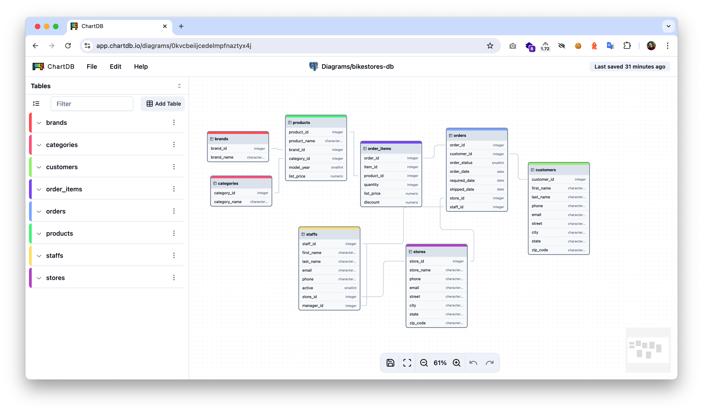

<h1 align="center">
  <a href="https://chartdb.io#gh-light-mode-only">
    
  </a>
  <a href="https://chartdb.io##gh-dark-mode-only">
    
  </a>
  <br>
</h1>

<p align="center">
  <b>Open-source database diagrams editor</b> <br />
  <b>No installations • No Database password required.</b> <br />
</p>

<h3 align="center">
  <a href="https://discord.gg/QeFwyWSKwC">Community</a>  &bull;
  <a href="https://www.chartdb.io?ref=github_readme">Website</a>  &bull;
  <a href="https://chartdb.io/templates?ref=github_readme">Examples</a>  &bull;
  <a href="https://app.chartdb.io?ref=github_readme">Demo</a>
</h3>

<h4 align="center">
  <a href="https://github.com/chartdb/chartdb?tab=AGPL-3.0-1-ov-file#readme">
    
  </a>
  <a href="https://github.com/chartdb/chartdb/blob/main/CONTRIBUTING.md">
    
  </a>
  <a href="https://discord.gg/QeFwyWSKwC">
    
  </a>
  <a href="https://x.com/intent/follow?screen_name=jonathanfishner">
    
  </a>

</h4>

---

<p align="center">
  
</p>

### 🎉 ChartDB

ChartDB is a powerful, web-based database diagramming editor.
Instantly visualize your database schema with a single **"Smart Query."** Customize diagrams, export SQL scripts, and access all features—no account required. Experience seamless database design here.

**What it does**:

- **Instant Schema Import**
  Run a single query to instantly retrieve your database schema as JSON. This makes it incredibly fast to visualize your database schema, whether for documentation, team discussions, or simply understanding your data better.

- **AI-Powered Export for Easy Migration**
  Our AI-driven export feature allows you to generate the DDL script in the dialect of your choice. Whether you're migrating from MySQL to PostgreSQL or from SQLite to MariaDB, ChartDB simplifies the process by providing the necessary scripts tailored to your target database.
- **Interactive Editing**
  Fine-tune your database schema using our intuitive editor. Easily make adjustments or annotations to better visualize complex structures.

### Status

ChartDB is currently in Public Beta. Star and watch this repository to get notified of updates.

### Supported Databases

- ✅ PostgreSQL ( +  +  )
- ✅ MySQL
- ✅ SQL Server
- ✅ MariaDB
- ✅ SQLite ( +  Cloudflare D1)
- ✅ CockroachDB
- ✅ ClickHouse

## Getting Started

Use the [cloud version](https://app.chartdb.io?ref=github_readme_2) or deploy locally:

### How To Use

```bash
npm install
npm run dev
```

### Build

```bash
npm install
npm run build
```

Or like this if you want to have AI capabilities:

```bash
npm install
VITE_OPENAI_API_KEY=<YOUR_OPEN_AI_KEY> npm run build
```

### Run the Docker Container

```bash
docker run -e OPENAI_API_KEY=<YOUR_OPEN_AI_KEY> -p 8080:80 ghcr.io/chartdb/chartdb:latest
```

#### Build and Run locally

```bash
docker build -t chartdb .
docker run -e OPENAI_API_KEY=<YOUR_OPEN_AI_KEY> -p 8080:80 chartdb
```

#### Using Custom Inference Server

```bash
# Build
docker build \
  --build-arg VITE_OPENAI_API_ENDPOINT=<YOUR_ENDPOINT> \
  --build-arg VITE_LLM_MODEL_NAME=<YOUR_MODEL_NAME> \
  -t chartdb .

# Run
docker run \
  -e OPENAI_API_ENDPOINT=<YOUR_ENDPOINT> \
  -e LLM_MODEL_NAME=<YOUR_MODEL_NAME> \
  -p 8080:80 chartdb
```

> **Privacy Note:** ChartDB includes privacy-focused analytics via Fathom Analytics. You can disable this by adding `-e DISABLE_ANALYTICS=true` to the run command or `--build-arg VITE_DISABLE_ANALYTICS=true` when building.

> **Note:** You must configure either Option 1 (OpenAI API key) OR Option 2 (Custom endpoint and model name) for AI capabilities to work. Do not mix the two options.

Open your browser and navigate to `http://localhost:8080`.

Example configuration for a local vLLM server:

```bash
VITE_OPENAI_API_ENDPOINT=http://localhost:8000/v1
VITE_LLM_MODEL_NAME=Qwen/Qwen2.5-32B-Instruct-AWQ
```

### Cloud storage (Firestore)

By default ChartDB stores diagrams only in the browser (IndexedDB), exactly as before. Setting `VITE_STORAGE_MODE=cloud` switches the storage backend to Firestore instead, where every diagram is part of one shared workspace: any signed-in client (including anonymous ones) can see and edit every diagram - there's no per-diagram ownership or invite step, sharing is just the default. See `chartdb-firestore-sharing-proposal.md` for the design behind this (note the proposal describes a per-diagram invite/ACL model; the actual implementation was simplified to a fully shared workspace instead, based on how it was actually going to be used).

To try it:

1. Create a project at [console.firebase.google.com](https://console.firebase.google.com), then enable **Firestore Database** and, under **Authentication → Sign-in method**, enable the **Anonymous** provider (every client needs *some* Firebase Auth identity for the security rules to check against - it doesn't need to be a named account).
2. Deploy `firestore.rules` from the repo root to that project. The repo already has `firebase.json`/`firestore.indexes.json` pointing at it, so you just need to link the CLI to your project once:

   ```bash
   npm install -g firebase-tools   # if you don't have it
   firebase login
   cd chartdb                      # repo root, where firebase.json lives
   firebase use --add              # pick your project, e.g. alias it "default"
   firebase deploy --only firestore:rules
   ```

   (`firebase deploy` on its own errors with "Not in a Firebase app directory" if you skip `firebase use --add` — that step is what creates `.firebaserc` linking this folder to your project.) Alternatively, skip the CLI entirely and paste `firestore.rules`'s contents into the Firestore **Rules** tab in the console.
3. Grab the web app config from Project settings → General → Your apps, and set these when building/running:

```bash
VITE_STORAGE_MODE=cloud
VITE_FIREBASE_API_KEY=<...>
VITE_FIREBASE_AUTH_DOMAIN=<project-id>.firebaseapp.com
VITE_FIREBASE_PROJECT_ID=<project-id>
VITE_FIREBASE_STORAGE_BUCKET=<project-id>.appspot.com
VITE_FIREBASE_MESSAGING_SENDER_ID=<...>
VITE_FIREBASE_APP_ID=<...>
```

For the Docker image, the same variables can be passed at `docker run` time without `VITE_` (e.g. `-e STORAGE_MODE=cloud -e FIREBASE_API_KEY=<...>`), since they're injected at container start via `entrypoint.sh`/`default.conf.template`, the same way `OPENAI_API_KEY` already works.

Open diagrams sync live across clients: `StorageContext.subscribeToDiagram` (implemented in `firestore-storage-provider.tsx`, wired into `ChartDBProvider`) listens for changes to whichever diagram is open and merges them straight into the canvas, so a second browser sees edits without reloading. This deliberately favors availability over strict consistency - it never blocks a write waiting to check for conflicts, and a client that loses connectivity keeps working from Firestore's local cache and catches up automatically once back online. When a change comes in for something this client itself edited within the last few seconds, it shows a "Possible conflicting edit" toast so you know to double check that part of the diagram, rather than silently resolving it one way or the other.

> **Note:** Anyone who can reach your Firestore project with a Firebase Auth session (anonymous ones included) can read and write every diagram in it - that's the point (one shared workspace), but it also means this isn't scoped per-user or per-team. If you need that later, `firestore.rules` would need real (non-anonymous) sign-in plus per-diagram ACL checks re-added.

## Try it on our website

1. Go to [ChartDB.io](https://chartdb.io?ref=github_readme_2)
2. Click "Go to app"
3. Choose the database that you are using.
4. Take the magic query and run it in your database.
5. Copy and paste the resulting JSON set into ChartDB.
6. Enjoy Viewing & Editing!

## 💚 Community & Support

- [Discord](https://discord.gg/QeFwyWSKwC) (For live discussion with the community and the ChartDB team)
- [GitHub Issues](https://github.com/chartdb/chartdb/issues) (For any bugs and errors you encounter using ChartDB)
- [Twitter](https://x.com/intent/follow?screen_name=jonathanfishner) (Get news fast)

## Contributing

We welcome community contributions, big or small, and are here to guide you along
the way. Message us in the [ChartDB Community Discord](https://discord.gg/QeFwyWSKwC).

For more information on how to contribute, please see our
[Contributing Guide](/CONTRIBUTING.md).

This project is released with a [Contributor Code of Conduct](/CODE_OF_CONDUCT.md).
By participating in this project, you agree to follow its terms.

Thank you for helping us make ChartDB better for everyone :heart:.

## License

ChartDB is licensed under the [GNU Affero General Public License v3.0](LICENSE)
